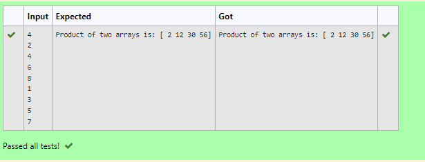

# Multiplying-two-matrix

## AIM:
To write a python program to multiply two
arrays using numpy

## ALGORITHM:

### Step 1:
To know the dimensions of the matrix get the input  from the user 
### Step 2:
iterations is used to get the user input as lists l1 and l2
### Step 3:
import numpy as np
### Step 4:
using array function aruguments are passed as a list
### Step 5:
multiply both matrices and print the value 

## PROGRAM: 
```
'''
Developed by: Haridharshini.S
reference number:21500176
'''
import numpy as np
a=int(input())
l1,l2=[],[]
for i in range(a):
    l1.append(int(input()))
for i in range(a):
    l2.append(int(input()))
A=np.array(l1)
B=np.array(l2)
multiplied_array=A*B
print("Product of two arrays is:",multiplied_array)
```

## OUTPUT:

## RESULT:
Hence the python program is executed succesfully to find the multiplication of two matrix
